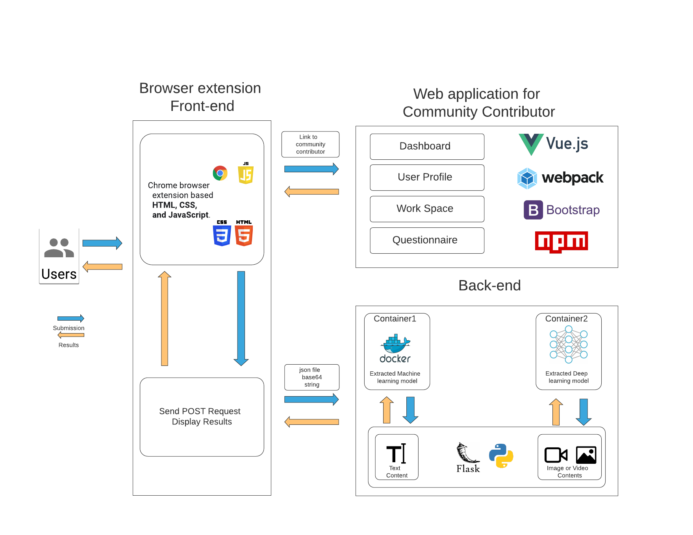
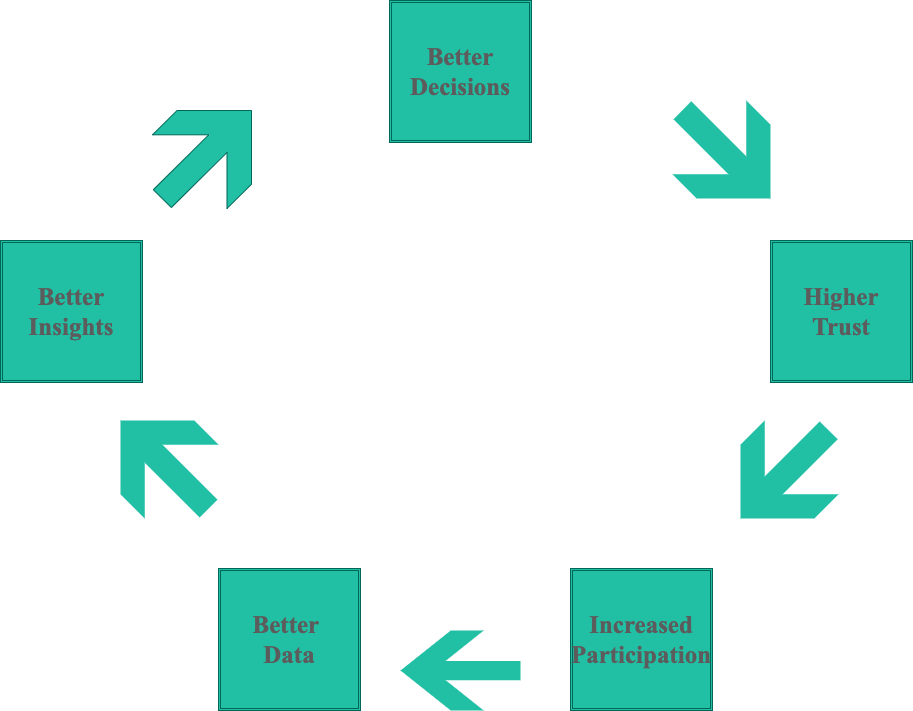
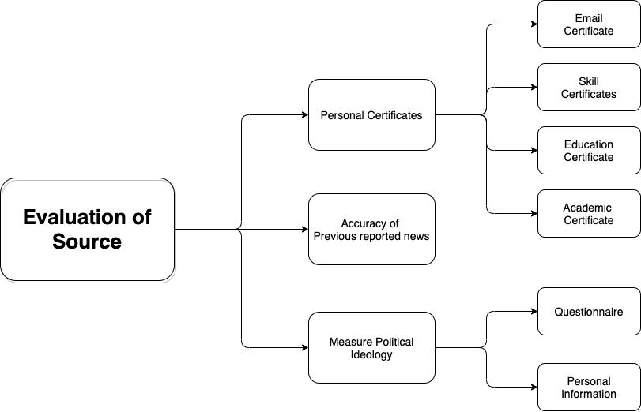

# Anti-misinformation-Platform
Anti-misinformation Platform combined with browser extension application, web application, and back-end. For the back-end,  I used built-in machine learning model to classify the text string information and used Xception model with fine-tune to analysis the images and videos data. 

## DEMO

## System Architecture

## Misinformation_Flask_API(Back-end)
[Project link](https://github.com/YunfanXu/Misinformation_Flask_API)

This is the back-end of the system, it contains pretrained Xception model to classify the manipulated facial iamges and videos, which includes Deepfakes, Face2Face, and FaceSwap. For more details for the model, please check my previous porject [here](https://github.com/YunfanXu/Detection-of-Manipulated-Facial-Video).

## misinformation_UI(Browser extension Front-end)
[Project link](https://github.com/YunfanXu/misinformation_slayer)

This is the front-end project for the Chrome brwoser extension. You can add it into your chrome and then start the **Misinformation_Flask_API** back-end first.

## Reporters_platform(Web application Front-end)
[Project link](https://github.com/YunfanXu/Reporters_platform)
This is the front-end for the reporters paltform which help the reporters to maintain their personal infromation and record their daily works. 

###  Theory
In order to gather more people into this application, I plan to introduce  the Trust Management and Evaluating the Source in the project and also create a RATING System to give the feedback for the reporters, and inspire and encourage reporters to do more effort.

#### WHY Trust Management?

One of those key actions is to continue to deliver accurate data and insights we can rely on. To do that we need high data quality, and for that we need willing and qualified participants(reporters), which takes up back to trust.

#### WHY Evaluating the Source?

Based on "The Influence of Political Ideology on Fake News Belief: The Portuguese Case", the political ideology will affect the classification of the fake news for the reporter. Thus, we have to evaluate the belief and the left–right political-ideological dimension. According. to the image as below, I want to use Personal certificates, Accuracy of Previous reported news, and Measure political ideology to evalulate the source. The main purpose of these steps is to collect accuracte data.

